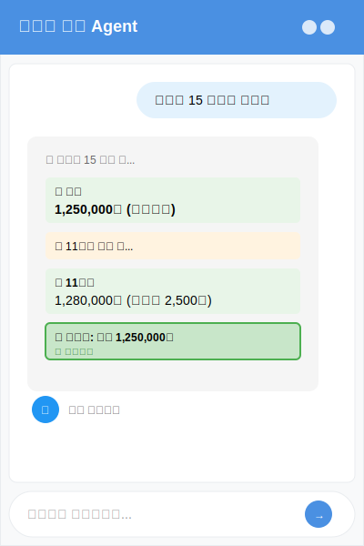
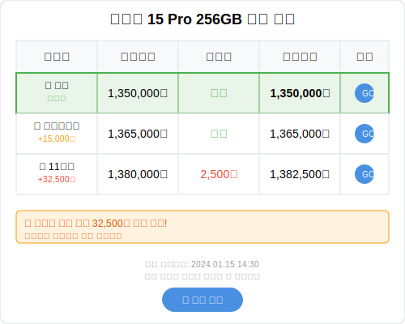

# 온라인 쇼핑 최저가 검색 Agent - UI/UX 와이어프레임

## 주요 화면 설계

### 1. 메인 채팅 인터페이스

#### 구성 요소

- **헤더**: 앱 제목, 상태 표시
- **채팅 영역**: 사용자 메시지와 Agent 응답
- **스트리밍 응답**: 실시간 검색 진행 상황 표시
- **입력 영역**: 자연어 질문 입력
- **히스토리 버튼**: 이전 검색 기록 빠른 접근

#### 특징

- **반응형 디자인**: 모바일과 데스크톱 모두 최적화
- **실시간 업데이트**: 검색 진행에 따라 UI 동적 변경
- **시각적 피드백**: 이모지와 색상으로 직관적 정보 전달

### 2. 가격 비교 테이블

#### 구성 요소

- **순위 표시**: 1,2,3등 시각적 구분 (🥇🥈🥉)
- **가격 정보**: 상품가격, 배송비, 최종가격 분리 표시
- **차이 표시**: 최저가 대비 추가 비용 색상으로 구분
- **구매 링크**: 각 쇼핑몰 바로가기 버튼
- **절약 정보**: 최대 절약 금액 하이라이트

#### 특징

- **최저가 강조**: 녹색 테두리와 배경으로 최저가 하이라이트
- **비용 투명성**: 숨겨진 비용 없이 모든 비용 명시
- **실행 가능한 정보**: 클릭 한 번으로 구매 페이지 이동

## 반응형 설계

### 모바일 (360px ~ 768px)

- **세로 레이아웃**: 채팅 방식으로 순차 표시
- **터치 최적화**: 버튼 크기 44px 이상
- **스와이프 제스처**: 좌우 스와이프로 쇼핑몰 전환

### 태블릿 (768px ~ 1024px)

- **분할 화면**: 채팅과 비교표 동시 표시
- **드래그 앤 드롭**: 상품 비교를 위한 드래그 지원

### 데스크톱 (1024px+)

- **멀티 패널**: 채팅, 비교표, 히스토리 동시 표시
- **키보드 단축키**: 빠른 검색을 위한 단축키 지원
